# School System for Admin, Faculty, and Students!

This is an SSM school management system written in Java. Framework used: Shiro, Spring, MySQL, Bootstrap, and Maven.
Functionalities include: user login, password update, course enrollment/drop, view/update course info, grades assignment, etc.

## Frameworks
IOC：Spring

Web:SpringMVC

ORM：Mybatis

Security：Shiro

DataSource ：C3P0

log：log4j

Frontend：Bootstrap

---
## Setup
1. Create new database in MySQL and import sql/examination_system.sql to initialize the database
2. Find mysql.properties in src/main/resources and define correct login credentials.
3. Import project in IntelliJ IDEA and run Maven builds.
4. Set up Tomcat in IntelliJ. After running all Maven build, a .war file will be generated in target/. Add this .war file to your web_app folder under your Tomcat folder.
5. In Tools->External Tools, launch Tomcat. The web will be in the Tomcat local host.
---
### Login Page:
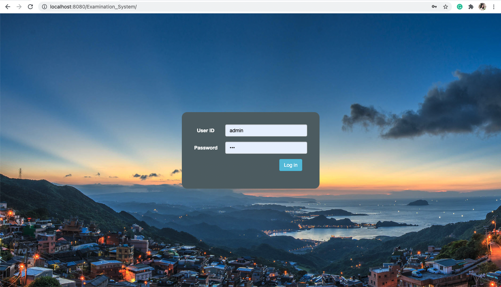

---
### Admin:
Available Features:
1. Create/Update user account (students, faculty members)
2. Create/Update courses
3. Reset other users' passwords
4. Reset Admin password

View all courses:
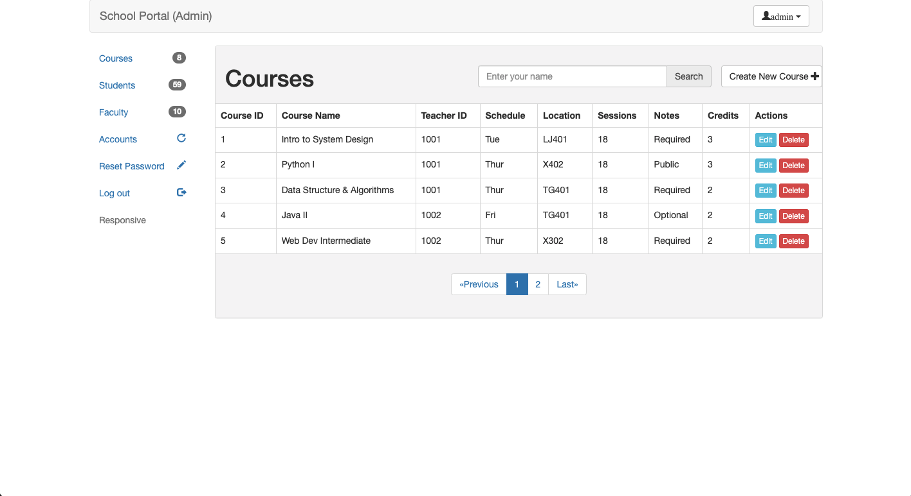

View all students:
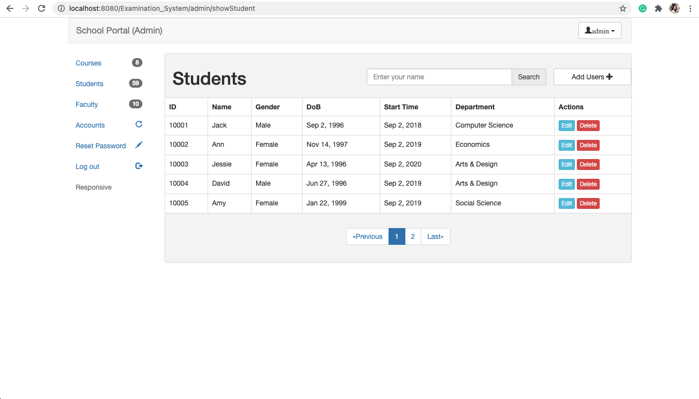

View all faculty members:
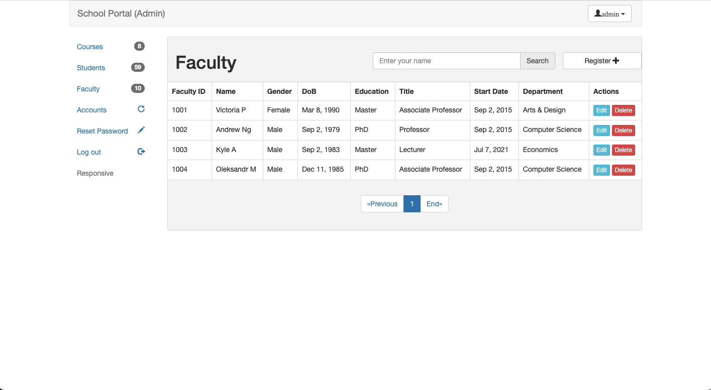

Add/update new students / courses / faculty members
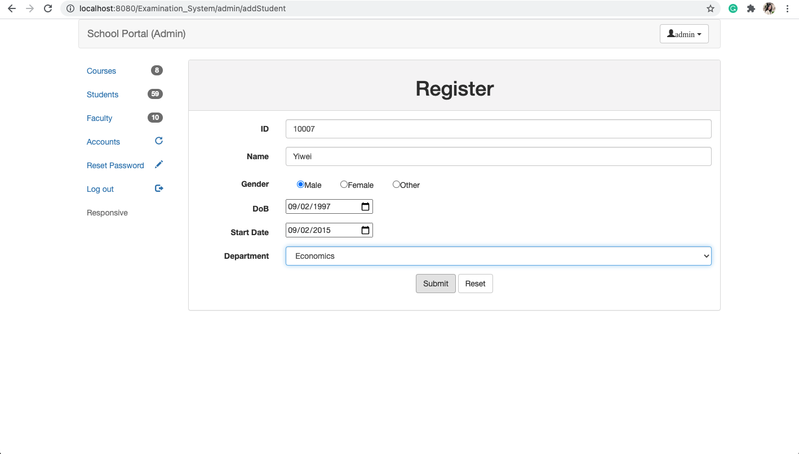
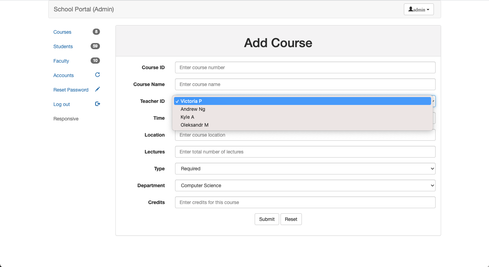

---
### Students:
Available Features:
1. See all available courses
2. Enroll Courses
3. Drop Courses
4. Reset Password

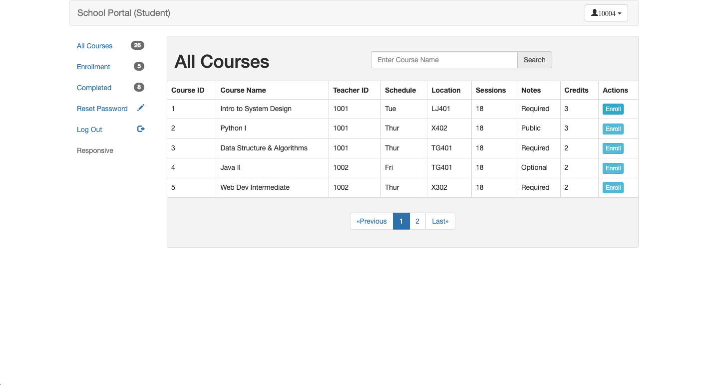
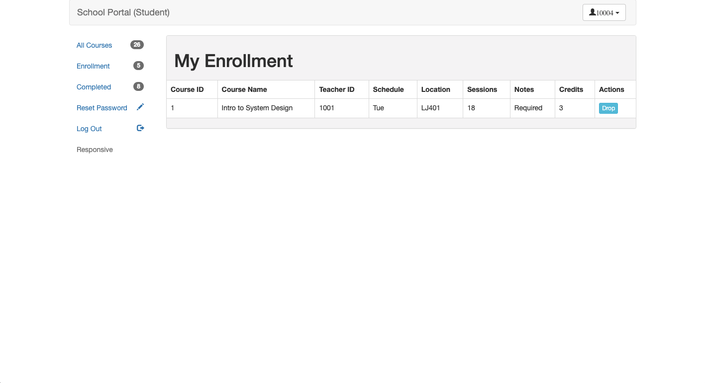

---
### Teachers/Faculty:
Available Features:
1. See instructed courses and students in the class
2. Grade students in each course
3. Reset Password

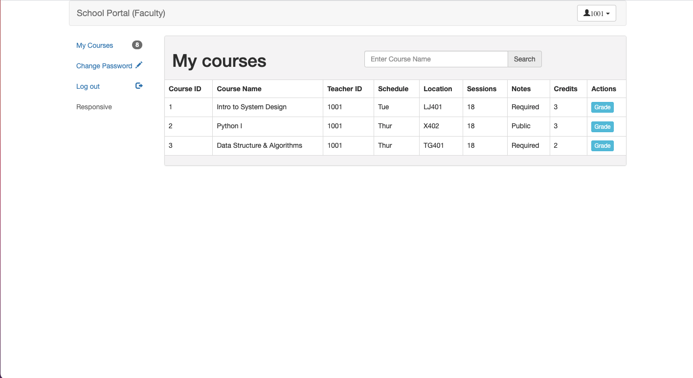
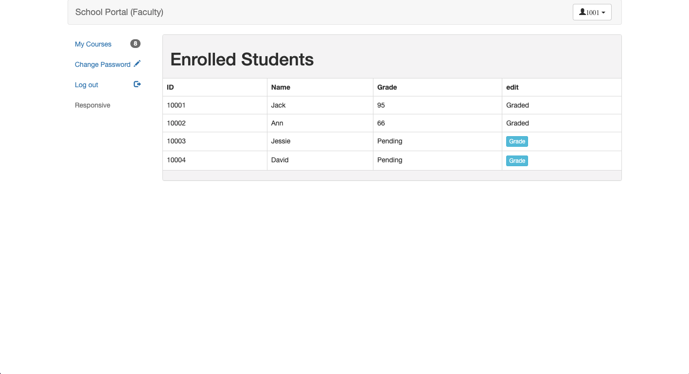
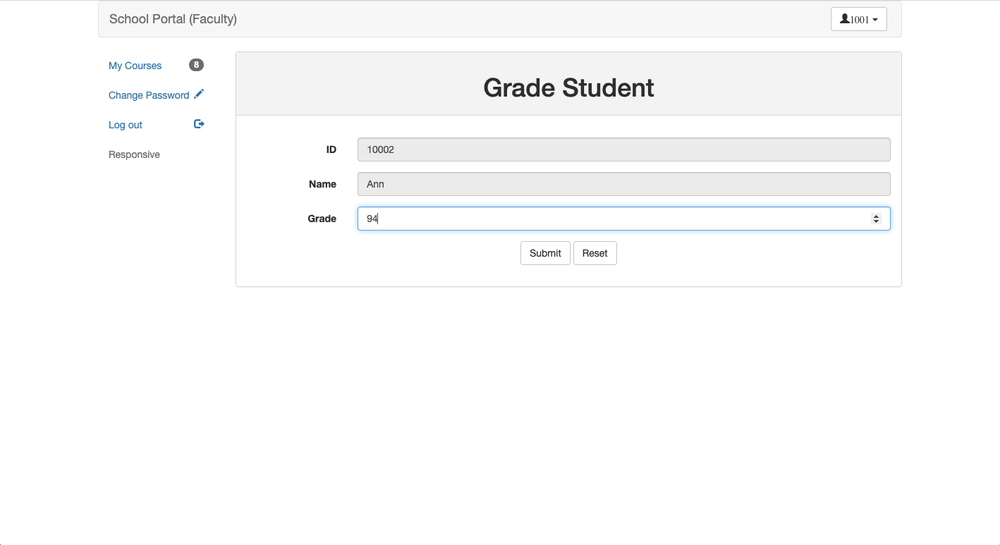
